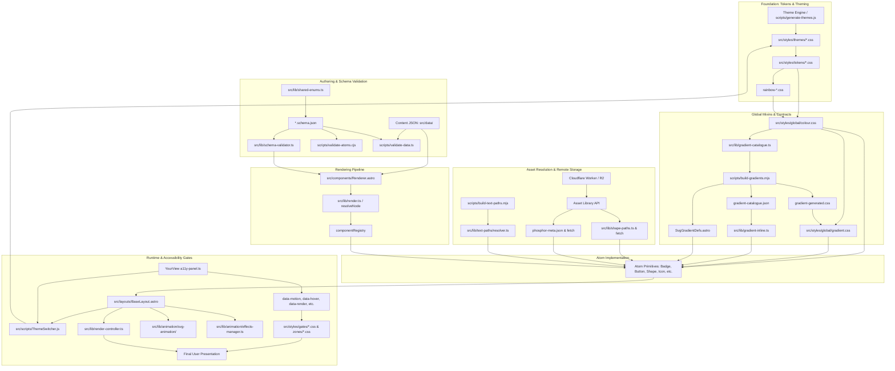
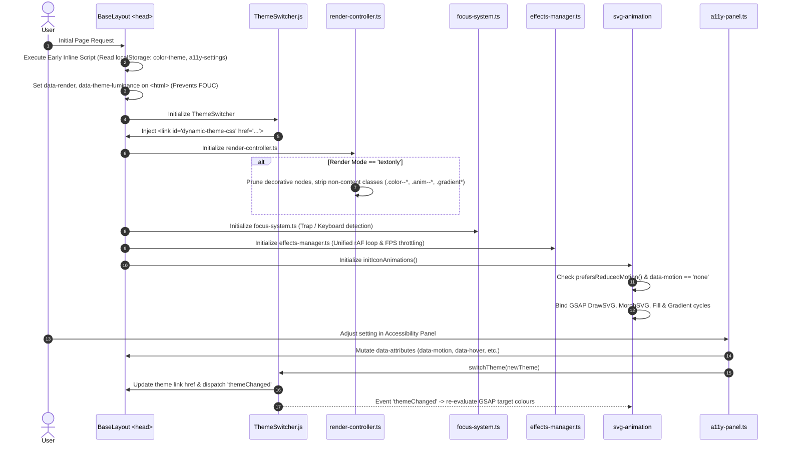
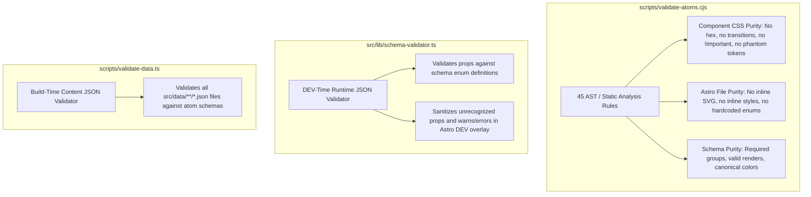
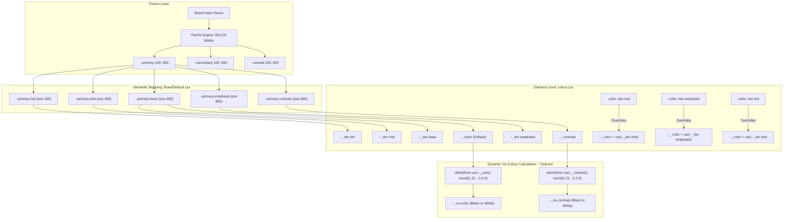
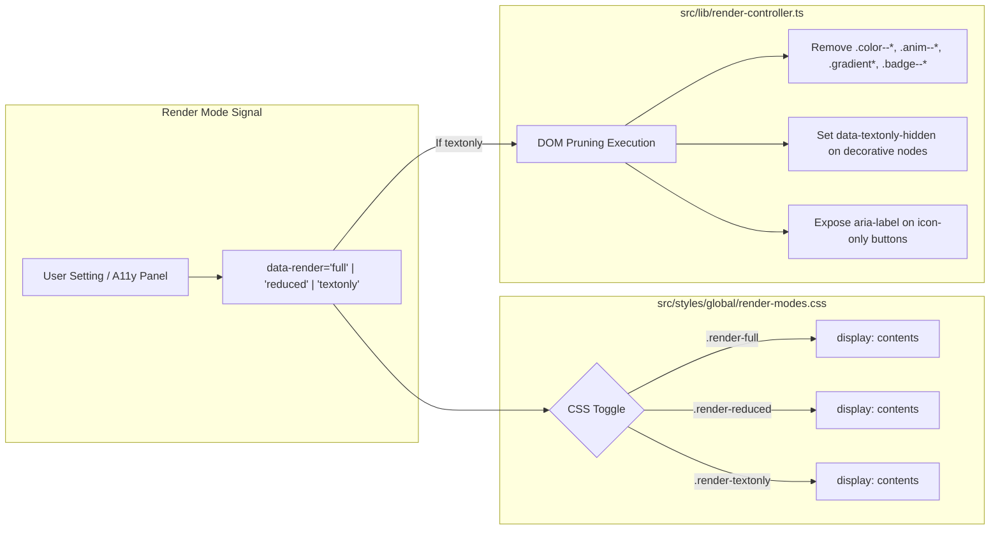
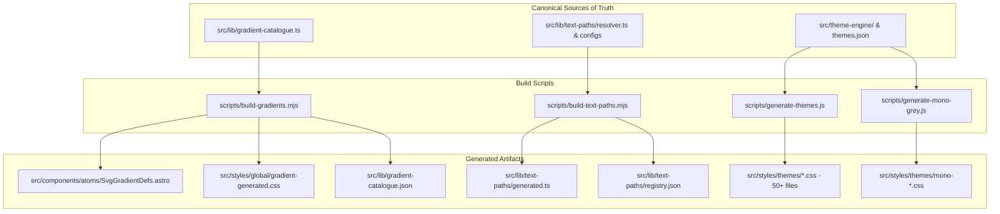
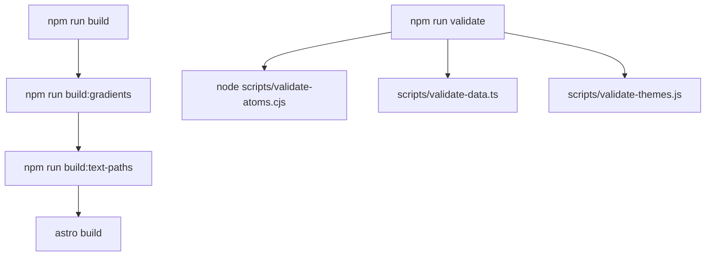
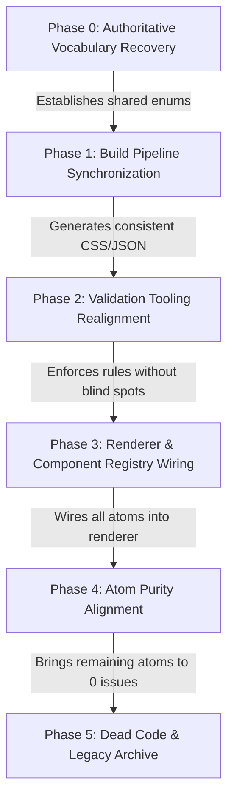

# STELLADORE COMPLETE SYSTEM RECOVERY & ARCHITECTURAL AUDIT

**Repository:** `C:\Users\Business\Website v2.36`  
**Date:** September 2026  
**Status:** Forensic Baseline / Pre-Implementation Architectural Recovery  
**Authority:** Live Code Implementation (`_reference/` folder treated strictly as non-authoritative historical archive)

---

## 1. Executive Summary

This forensic audit represents the complete architectural recovery of the Stelladore design and rendering engine as implemented across `C:\Users\Business\Website v2.36`. 

Following previous targeted audits of the Badge atom and Foundational Contracts, this document maps the entirety of the codebase's 35 discrete, interacting systems. It establishes their exact dependencies, token creations and consumptions, CSS layer hierarchies, runtime interactions, schema/validator boundaries, asset resolution mechanisms, accessibility gates, and known divergences.

### Key Discoveries
1. **The System Is a High-Order Multi-System Machine**: The codebase does not merely represent a component library. It is a multi-brand, multi-accessibility, build-time and runtime hybrid architecture comprising:
   - Dynamic OKLCH theme generation with CVD (Colour Vision Deficiency) and luminance awareness.
   - Dual CSS/SVG token-driven gradient interpolation.
   - Multi-axis accessibility gates (hover, motion, speed, opacity, focus, render modes, alt-text, and AAC/Bliss pictograms).
   - Coordinated runtime animation ecosystems (GSAP, Matter.js physics, canvas liquid reveal, SVG draw/morph).
   - Build-time Asset Library API resolution.
2. **Dual Source of Truth Divergences**:
   - `shared-enums.ts` vs `shared-enums.json`: Disconnected. TypeScript uses token-matching rainbow positional names (`rainbow-1`..`rainbow-7`), 4 sizes (`sm`, `md`, `lg`, `xl`), and 11 heading sizes; JSON uses literal colour names (`red`..`pink`), 3 sizes, and 6 heading sizes.
   - Gradient Catalogue: `src/lib/gradient-catalogue.ts` vs `scripts/build-gradients.mjs`: `build-gradients.mjs` duplicates the catalogue definition in plain JS and has drifted (e.g. `tier3Stop` has 3 stops in TS, but 2 stops in the build script).
   - Theme Engine: `src/theme-engine/` (modular generator used by `scripts/generate-themes.js`) vs `src/utils/theme-engine.js` (monolith with stale rainbow generator functions).
3. **Dead and Unwired Render Paths**:
   - `src/lib/render-pipeline.ts` and `src/lib/render-rules.json` are completely unimported and dead.
   - `src/scripts/theme.ts` is completely unimported and uses invalid Tailwind classes (`text-[var(--theme-text-muted)]`) while `ThemeSwitcher.js` is the live runtime engine.
   - Live rendering is governed strictly by: `Content JSON → Renderer.astro (DEV validator) → src/lib/render.ts (resolveNode) → Atom.astro → CSS & Gates → BaseLayout.astro (render-controller.ts DOM transforms)`.
4. **Architectural Soundness**: The fundamental concept of the "Colour Mixin" (`.color--*` setting `--_tier-*`, `--_color`, `--_contrast`, `--_on-color`) driving the "Gradient Mixin" and downstream atoms is exceptionally sound and functional. Once shared vocabulary and build scripts are synchronised to live code, the core rendering pipeline is stable.

---

## 2. Complete System Inventory

The repository contains **35 distinct systems** categorized into 7 functional domains:

### Domain A: Token & Design Systems
1. **Core Design Tokens (`src/styles/tokens/`)**: Global scales for spacing, typography, borders, radii, layout, depth, confetti, and bars.
2. **Global Colour Mixin (`src/styles/global/colour.css`)**: Defines `.color--*`, `.color--tier-*`, and sets private context tokens `--_tier-*`, `--_color`, `--_contrast`, `--_on-color`, `--_on-contrast`.
3. **Colour Tiers & On-Colour Formula**: Universal OKLCH contrast engine calculating black/white pairing dynamically (`round(1.21 - l)`).
4. **Rainbow Token Scale (`src/styles/tokens/rainbow-*.css`)**: 9 static palettes (`default`, `dark`, `protan`, `dark-protan`, `tritan`, `dark-tritan`, `calm`, `mono`, `hc`) mapping `--rainbow-1`..`--rainbow-7`.
5. **Brand Theme Definitions (`src/styles/themes/`)**: 50+ theme CSS files generated per brand/luminance/CVD combination.
6. **Theme Engine & Generation (`src/theme-engine/`)**: OKLCH colour maths, CVD simulation, and CSS generator scripts (`scripts/generate-themes.js`, `generate-mono-grey.js`).
7. **Gradient Catalogue & Generation**: `gradient-catalogue.ts` recipes, `build-gradients.mjs` script, `gradient-catalogue.json`, and `SvgGradientDefs.astro`.
8. **Gradient CSS Mixin (`src/styles/global/gradient.css`)**: `.gradient`, `.gradient__text`, `.gradient--fill`, `.gradient--outline`, `.gradient--glass`, and animated classes.
9. **Inline Gradient Runtime (`src/lib/gradient-inline.ts`)**: Direction-aware dynamic angle-to-SVG-coordinate generator for Shape, Icon, and Heading.
10. **Glass & Liquid Glass System (`src/styles/tokens/glass.css`)**: Backdrop filter tokens, SVG glass opacities, and pseudo-element liquid glass filters.
11. **Shadows & Elevation System (`src/styles/tokens/shadows.css`, `effects.css`)**: Base, elevated, and neumorphic box-shadows driven by non-flipping `--shadow-Black` and `--shadow-White`.
12. **Borders & Radii (`src/styles/tokens/borders.css`)**: Scaled stroke widths and radii with atomic aliases.

### Domain B: Typography & Presentation
13. **Typography & Font Engine (`src/styles/tokens/typography.css`)**: Type scale, line heights, letter-spacing, and Astro Fonts integration (`Quicksand`, `Caveat`, `Lora`, `Atkinson`, `Sukar`, `Crumbo`, `OpenDyslexic`).
14. **Text Utilities & Mixins**: `prose.css`, `underline.css` (solid, gradient, dashed, dotted), `text-highlight.css`, `text-shadow.css`.
15. **Responsive Layout System (`src/styles/tokens/responsive.css`, `src/styles/base/`)**: Breakpoint system with micro/XS overrides, container scales, and grid collapsing.

### Domain C: Animation & Interactivity
16. **Effects Manager ("The Holy Trinity") (`src/lib/animation/effects-manager.ts`)**: IntersectionObserver and rAF-coordinated manager balancing `PhysicsOverlay` (Matter.js), `RevealCanvas` (2D Canvas), and `PatternOverlay` (CSS/GSAP).
17. **SVG Animation Pipeline (`src/lib/animation/svg-animation/`)**: GSAP-driven draw, morph, fill, gradient cycle, and micro-animation handlers sharing the `data-icon-*` contract across Icon and Shape.
18. **Animation Gating & Trigger Queue (`src/lib/animation/gates/`, `triggers/`)**: Speed multiplier calculation, reduced motion suppression, and viewport stagger queuing.
19. **Particle Systems (`src/lib/animation/particle-*`)**: Auto-binding click/hover particle generators for `fly`, `physics` (Matter.js), and `string` (Verlet rope).
20. **Focus & Caret System (`src/lib/focus/`, `src/lib/caret/`)**: Custom visible caret rendering, form bookmarking, and keyboard focus rings.

### Domain D: Accessibility (Ally) Architecture
21. **Accessibility Gates (`src/styles/gates/`)**: CSS attribute gates for `hover` (`data-hover`), `motion` (`data-motion`), `speed` (`data-anim-speed`), `opacity` (`data-visual`), `focus` (`:focus-visible`), `reduced` (`[data-render="reduced"]`), `assistive` (`[data-render="assistive"]`), `alt-text`, and `anim-explainer`.
22. **Accessibility Context Zones (`src/styles/zones/`)**: Global overrides for `theme-luminance-dark.css`, `theme-chroma-calm.css`, `high-contrast.css`, and `no-chroma.css`.
23. **Render Modes (`src/styles/global/render-modes.css`, `src/styles/textonly/`)**: Three-mode visibility (`full`, `reduced`, `textonly`) complemented by client-side class pruning in `render-controller.ts`.
24. **AAC & Bliss Grammar Engine (`src/lib/aac/`)**: English grammatical indicator detection mapping to Bliss BCI reference numbers and OpenAAC pictogram resolution.
25. **YourView Accessibility Panel (`src/components/YourView/`)**: Authoring and user preference manager storing 35 accessibility parameters in `localStorage` (`a11y-settings`).
26. **Theme Switcher (`src/scripts/ThemeSwitcher.js`)**: Dynamic stylesheet swapping via `<link id="dynamic-theme-css">` with metadata attribute reflection (`data-theme-luminance`, `data-theme-chroma`, `data-theme-no-chroma`).

### Domain E: Asset Management
27. **Phosphor Icon System**: Build-time Asset API resolution with `phosphor-meta.json` (5,300+ icons, 5 weights, flat morph variants).
28. **Shape Asset System (`src/lib/shape-paths.ts`, Asset API)**: Built-in 100×100 SVG paths supplemented by build-time API fetch for custom slugs.
29. **Text Path Resolver (`src/lib/text-paths/`)**: Build-time pre-baked SVG glyph path generation for logos and brand phrases via `build-text-paths.mjs`.
30. **Lottie Asset System (`src/components/atoms/LottieIcon/`)**: Remote/API-fetched vector animation JSON with phosphor fallback.
31. **Cloudflare Worker & R2 Integration**: Remote asset microservices (`asset-library.natashacharlton25.workers.dev`) serving icons, shapes, and Bliss SVGs.

### Domain F: Component Architecture
32. **Atom Component Suite (`src/components/atoms/`)**: 20 atomic primitives (Badge, Burst, Button, Card, Caret, FigCaption, FormField, Grid, Heading, Icon, Image, Link, List, LottieIcon, Page, Section, Shape, Text, TextEffect, Tooltip).
33. **Astro Component Registry (`src/lib/render.ts`)**: Mapping of JSON `component` strings to Astro component imports.

### Domain G: Rendering & Verification Pipeline
34. **JSON Component Renderer (`src/components/Renderer.astro`, `src/lib/render.ts`)**: Recursive component resolver and prop spreader with dev-mode schema validation.
35. **Validation Suite (`scripts/validate-atoms.cjs`, `scripts/validate-data.ts`, `src/lib/schema-validator.ts`)**: 45 pipeline rules enforcing atom purity, schema constraints, and token usage.

---

## 3. System Dependency Graph

The entire repository follows an architectural dependency chain. Upstream systems establish tokens, classes, or contracts that downstream systems consume. Reversing this flow or skipping layers causes broken cascades.



---

## 4. Token Dependency Graph

Stelladore separates tokens into three strict scopes:
1. **Public Global Design Tokens** (Defined at `:root`, consumed by any component or mixin).
2. **Private Context Tokens** (Set by `.color--*` and `.gradient` on the specific element, prefixed with `--_`).
3. **Computed Derived Tokens** (Calculated dynamically via `oklch()` or `color-mix()` from private context tokens).

```mermaid
flowchart LR
    subgraph Themes [Theme Engine Output]
        P_Tint[--primary-tint]
        P_Mid[--primary-mid]
        P_Base[--primary-base]
        P_Emp[--primary-emphasis]
        P_Cont[--primary-contrast]
        R_Tokens[--rainbow-1..7, tints, mids, emphasis]
        PageBg[--page-bg]
    end

    subgraph ColourMixin [src/styles/global/colour.css]
        direction TB
        ClassCol[.color--primary / .color--rainbow-*]
        ClassTier[.color--tier-tint / mid / emphasis]
        
        P_Tint & P_Mid & P_Base & P_Emp & P_Cont --> ClassCol
        R_Tokens --> ClassCol
        
        ClassCol --> PrivTint[--_tier-tint]
        ClassCol --> PrivMid[--_tier-mid]
        ClassCol --> PrivBase[--_tier-base]
        ClassCol --> PrivColor[--_color]
        ClassCol --> PrivEmp[--_tier-emphasis]
        ClassCol --> PrivCont[--_contrast]
        
        ClassTier --> PrivColor
    end

    subgraph ComputedTokens [Contrast & Derived Tokens]
        PrivColor --> OnColor["--_on-color (oklch round(1.21 - l))"]
        PrivCont --> OnContrast["--_on-contrast (oklch round(1.21 - l))"]
    end

    subgraph GradientMixin [src/styles/global/gradient.css]
        PrivTint & PrivMid & PrivColor & PrivEmp --> GradComp["--_grad-computed (linear-gradient in oklab)"]
        PageBg --> GradComp
    end

    subgraph Consumers [Components: Badge, Button, Shape, Icon, Text, Heading]
        PrivColor --> TextColor[color: var\(--_color\)]
        OnColor --> SurfaceText[color: var\(--_on-color\)]
        OnContrast --> HoverText[color: var\(--_on-contrast\)]
        GradComp --> BgGrad[background: var\(--_grad-computed\)]
        GradComp --> TextClip[background-clip: text]
    end
```

### Established vs. Consumed Token Matrix

| System | Tokens Established | Tokens Consumed | Classification |
| :--- | :--- | :--- | :--- |
| **Theme Engine** (`writer.js`) | `--primary-*`, `--secondary-*`, `--neutral-*`, `--text-*`, `--page-bg*`, `--shadow-Black`, `--shadow-White`, `--theme-luminance`, `--theme-chroma` | None (Generates absolute hexes) | `CURRENT` |
| **Rainbow Tokens** (`rainbow-*.css`) | `--rainbow-1`..`--rainbow-7`, `--rainbow-N-tint`, `--rainbow-N-mid`, `--rainbow-N-emphasis` | None (Static CSS tokens) | `CURRENT` |
| **Colour Mixin** (`colour.css`) | `--_tier-tint`, `--_tier-mid`, `--_tier-base`, `--_color`, `--_tier-emphasis`, `--_contrast`, `--_on-color`, `--_on-contrast`, `--on-highlight-link-color`, `--on-neutral-mid`, `--on-primary-base` | `--primary-*`, `--secondary-*`, `--neutral-*`, `--text-*`, `--rainbow-*` | `CURRENT` |
| **Gradient Mixin** (`gradient.css`) | `--_grad-computed`, `--_grad-anim-duration` | `--_tier-tint`, `--_tier-mid`, `--_color`, `--_tier-emphasis`, `--_grad-angle`, `--page-bg`, `--glass-bg`, `--glass-blur`, `--neutral-mid`, `--border-width`, `--border-width-2` | `CURRENT` |
| **Generated Gradients** (`gradient-generated.css`) | Overrides `--_grad-computed` per `.gradient--blend-{id}` | Theme tokens (`--primary-base`, etc.) or `--_bg-context`, `--page-bg` | `CURRENT` |
| **Borders** (`borders.css`) | `--border-width`, `--border-width-2`, `--border-width-md`, `--border-width-4`, `--border-width-lg`, `--border-width-8`, `--border-radius-*`, `--radius-*` | None | `CURRENT` |
| **Glass** (`glass.css`) | `--glass-bg*`, `--glass-border*`, `--glass-blur*`, `--glass-text*`, `--glass-shadow*`, `--svg-glass-*`, `--liquid-blur`, `--liquid-tint`, `--liquid-inner-glow` | `--shadow-White`, `--shadow-Black`, `--page-bg`, `--primary-emphasis`, `--neutral-mid`, `--neutral-emphasis` | `CURRENT` |
| **Shadows** (`shadows.css`) | `--shadow-sm`, `--shadow`, `--shadow-md`, `--shadow-lg`, `--shadow-xl`, `--shadow-2xl`, `--shadow-elevated`, `--shadow-inner-*`, `--shadow-neu-*`, `--shadow-dropdown-md`, `--shadow-btn*` | `--shadow-Black`, `--shadow-White` | `CURRENT` |
| **Typography** (`typography.css`) | `--base-font-pct`, `--font-heading`, `--font-body`, `--font-body-alt`, `--font-handwriting`, `--font-display`, `--font-mono`, `--text-h1`..`--text-h5`, `--text-body`, `--text-lg`, `--text-quote`, `--text-small`, `--text-fine`, `--text-veryfine`, `--text-display*`, `--font-light`..`--font-extrabold`, `--leading-*`, `--letter-spacing-*` | Astro-generated `--font-quicksand`, `--font-caveat`, `--font-lora`, `--font-sukar`, `--font-crumbo` | `CURRENT` |
| **Assistive Gate** (`assistive-gate.css`) | Overrides component dimensions and layout | `--space-*`, `--border-radius-*` | `CURRENT` |
| **High Contrast Zone** (`high-contrast.css`) | Overrides `--border-width`, `--shadow-*` (cleared to none), `--glass-*` | `--color-White`, `--color-Black`, `--page-bg` | `CURRENT` |

---

## 5. CSS Layer Architecture

The codebase intentionally avoids CSS `@layer` directives. The cascade is controlled strictly through physical file import ordering in `src/styles/global.css` and `<head>` link placement.

### Complete Cascade Layering Sequence

1. **Reset Layer (`src/styles/base/reset.css`)**:
   - Resets box-sizing, margins, list-styles, and media defaults.
2. **Tokens Foundation (`src/styles/tokens/index.css`)**:
   - Typography → Spacing → Borders → Layout → Motion → Shadows → Effects → Glass → Images → SVG → Depth → Confetti → Image Utilities → Bars → Rainbow Scales (`default`..`hc`) → Gradients.
3. **Base Brand Theme (`src/styles/themes/BrandDefault.css`)**:
   - Initial static theme definition. Overridden at runtime by `ThemeSwitcher.js`.
4. **Effects & Organisms Base Styles**:
   - Scroll backgrounds, overlays (`PatternOverlay`, `PhysicsOverlay`), complex sections (`HeroSection`, `who-slider`, etc.), galleries, and banners.
5. **Contextual Zones (`src/styles/zones/`)**:
   - `theme-luminance-dark.css`: Dark mode adaptations (shadow kills, glass swaps, button hover shifts).
   - `theme-chroma-calm.css`: Calm/pastel mode (suppresses animations/shadows, forces glass badges).
   - `high-contrast.css`: Strict AAA high-contrast borders and overrides.
   - `no-chroma.css`: Achromatopsia / zero-hue perception mode (strips hue-dependent cues).
6. **Render Modes Base (`src/styles/global/render-modes.css`)**:
   - Controls visibility of `.render-full`, `.render-reduced`, `.render-textonly` via `[data-render]`.
7. **Accessibility Behavioral Gates (`src/styles/gates/`)**:
   - `hover-gate.css`, `motion-gate.css`, `speed-gate.css`, `opacity-gate.css`.
8. **Component Atomic CSS (Loaded via Barrels or Global Imports)**:
   - Atomic CSS (`Badge.css`, `Button.css`, `Card.css`, `Link.css`, `List.css`, `Tooltip.css`, `FormField.css`, `Image.css`) loaded via their respective `index.ts` barrels.
   - Molecule and Organism styling (`DPadMenu`, `RadialMenu`, `RainbowBorderCard`, `Grid.css`, `ImageOverlay`, `Footer`, `ContactForm`).
9. **Global Responsive Overrides (`src/styles/tokens/responsive.css`)**:
   - Viewport-specific adjustments across all atoms (tablet, mobile, xs, micro).
10. **Late Accessibility Gates & Overrides**:
    - `textonly.css`: Complete styling rules for the DOM pruned by `render-controller.ts`.
    - `focus-gate.css`: High-visibility custom focus rings (`:focus-visible`).
    - `reduced-gate.css`: Suppression of transforms and transitions when reduced motion is requested.
    - `assistive-gate.css`: Large touch targets, single-column flex flattening, and simplified layouts.
    - `alt-text-gate.css` & `anim-explainer-gate.css`: Two-axis alt-text and animation card stack gating.
11. **Global Element Mixins (`src/styles/global/`)**:
    - `text-highlight.css` → `colour.css` → `gradient.css` → `gradient-generated.css` → `text-shadow.css` → `underline.css` → `keyframes.css` → `highlight-links.css` → `image-enlarge.css` → `prose.css` → `transitions.css`.
12. **Dynamic Injected Theme Link (`#dynamic-theme-css`)**:
    - Injected dynamically by `ThemeSwitcher.js` at the very end of `<head>`. Overrides all previous theme declarations in the cascade.

---

## 6. Runtime Architecture

The client-side runtime executes asynchronously in the browser. All runtime scripts are initialized via `src/layouts/BaseLayout.astro`.



### Runtime System Roster
1. **`render-controller.ts`**: Runs immediately on DOM ready. Detects `[data-render="textonly"]`. Recursively traverses DOM and strips prop-driven classes (`color--*`, `gradient*`, `anim--*`, `*--fill`, `*--outline`, `*--glass`, `*--shadow`, `*--rounded`, `*--border`, `*--glow`, `*--uppercase`) so CSS defaults take over cleanly.
2. **`ThemeSwitcher.js`**: Replaces stylesheet links without full page reload. Scans active theme CSS custom properties (`--theme-luminance`, `--theme-chroma`, `--theme-intensity`) and reflects them as HTML data attributes (`data-theme-luminance="dark"`, `data-theme-no-chroma="true"`). Dispatches global `themeChanged` event.
3. **`effects-manager.ts`**: Coordinates Matter.js physics engine, 2D HTML5 canvas, and CSS patterns. Tracks browser frame rate; automatically throttles or disables physics when FPS falls below 30. Pauses off-screen animations via `IntersectionObserver`.
4. **`svg-animation/index.ts`**: Queries `[data-icon-draw]`, `[data-icon-morph]`, `[data-icon-fill]`, and `[data-icon-grad-anim]`. Applies GSAP tweens and timelines. Bails early if system reduced motion is active or `data-motion="none"`.
5. **`focus-system.ts`**: Tracks `Tab` key usage to apply enhanced visible focus rings, viewport scroll centering, and element dimming.
6. **`reload-overlay/reload-overlay.ts`**: Displays a brief brand-themed loader during major accessibility layout re-renders to prevent visual layout shifts.
7. **`custom-caret/custom-caret.ts` & `bookmark.ts`**: Emulates an accessible, tokenized cursor in form fields and restores previous form scroll locations.

---

## 7. JSON / Schema Boundary

Every renderable component defines a contract between author-facing content JSON and internal component props via `*.schema.json`.

### Canonical Schema Structure
```json
{
  "component": "Badge",
  "category": "atoms",
  "renders": {
    "full": "Badge.astro",
    "reduced": "Badge.astro",
    "textonly": "Badge.astro"
  },
  "props": {
    "content": { ... },
    "visual": { ... },
    "animation": { ... },
    "colour": { ... },
    "behaviour": { ... },
    "rainbow": { ... },
    "typography": { ... },
    "gradient": { ... }
  }
}
```

### Public JSON Vocabulary vs. Internal Atom Props

| Concept | Public JSON Vocabulary | Internal Astro Prop | Internal CSS / Data Output | Classification |
| :--- | :--- | :--- | :--- | :--- |
| **Text Content** | `contentBadge` | `contentBadge` (or `text`) | Rendered text node | `CURRENT` |
| **Brand Colour** | `brandColor` (`primary`, `secondary`, `neutral`) | `brandColor` | `.color--{name}` | `CURRENT` |
| **Rainbow Colour** | `rainbowColor` (`rainbow-1`..`rainbow-7`) | `rainbowColor` | `.color--rainbow-{N}` | `CURRENT` |
| **Colour Tier** | `colorTier` (`tint`, `mid`, `base`, `emphasis`) | `colorTier` | `.color--tier-{tier}` | `CURRENT` |
| **Variant** | `variant` (`fill`, `outline`, `glass`, `liquid-glass`) | `variant` | `.badge--{variant}` | `CURRENT` |
| **Shape** | `shape` (`sharp`, `subtle`, `soft`, `rounded`, `pill`) | `shape` | `.badge--{shape}` | `CURRENT` |
| **Size** | `size` (`sm`, `md`, `lg`, `xl`) | `size` | `.badge--{size}` | `CURRENT` |
| **Shadow** | `shadow` (`none`, `out`, `drop`, `in`, `elevated`, `glow`..) | `shadow` | `.badge--shadow-{shadow}` | `CURRENT` |
| **Gradient Enable** | `gradient` (`true` / `false`) | `gradient` | `.gradient` | `CURRENT` |
| **Gradient Blend** | `gradientBlend` (`hero`, `sunset`, `brand-emerge`..) | `gradientBlend` | `.gradient--blend-{blend}` | `CURRENT` |
| **Gradient Direction**| `gradientDirection` (`diagonal`, `horizontal`..) | `gradientDirection` | `data-grad-dir="{dir}"` | `CURRENT` |
| **Gradient Animation**| `gradientAnimated` (`true` / `false`) | `gradientAnimated` | `.gradient--animated` | `CURRENT` |
| **Semantic Role** | `semanticRole` (`decorative`, `ui-control`, `content-symbol`, `status`, `tag`, `label`) | `semanticRole` | `role="img"` / `role="button"` / `aria-hidden` | `CURRENT` |
| **Accessible Label** | `label<Atom>` (e.g. `labelBadge`, `labelShape`) | `label<Atom>` | `aria-label="{label}"` | `CURRENT` |
| **SVG Draw Mode** | `draw` (`true`, `draw`, `drawcenter`, `pulse`) | `draw` | `data-icon-draw="{draw}"` | `CURRENT` |
| **SVG Morph Target** | `morphTo` (icon slug name) | `morphTo` | `data-icon-morph="true"` | `CURRENT` |

---

## 8. Validator Boundary

The repository uses three distinct validators that enforce different boundaries:



### Validator Blind Spots & Rule Inconsistencies

1. **Rule 28 (`validate-atoms.cjs:630`)**:
   - *Constraint*: Strictly limits `renders` keys in `*.schema.json` to `['full', 'reduced', 'textonly']`.
   - *Blind Spot*: Throws a hard error if `assistive` is documented in `renders`, despite the fact that `[data-render="assistive"]` is a live CSS gate (`assistive-gate.css`) and was previously configured in `render-rules.json`.
   - *Classification*: `VALIDATOR BLIND SPOT` / `DIVERGENCE`.
2. **Rule 30 (`validate-atoms.cjs:636`)**:
   - *Constraint*: Enforces that `props.visual.color` matches `shared-enums.json:colour.all`.
   - *Blind Spot*: Modern atoms have decomposed `color` into `brandColor` and `rainbowColor` inside split groups (`colour` and `rainbow`). Rule 30 completely ignores these split groups, passing atoms that would fail single-property validation.
   - *Classification*: `VALIDATOR BLIND SPOT`.
3. **Rule 35 (`validate-atoms.cjs:665`)**:
   - *Constraint*: Requires all string props in `visual`, `animation`, and `behaviour` to have an enum.
   - *Blind Spot*: Completely ignores string props placed in `typography` or `gradient` groups.
   - *Classification*: `VALIDATOR BLIND SPOT`.
4. **Rule 42 (`validate-atoms.cjs:198`)**:
   - *Constraint*: Forbids importing atom CSS in `global.css` if the atom's barrel `index.ts` imports it (prevents duplicate CSS bundle emissions).
   - *Status*: Working properly for audited atoms (`Text`, `Heading`, `Badge`, `Button`, `Card`, `Tooltip`, `Link`, `List`, `FormField`, `Image`).
   - *Classification*: `CURRENT`.
5. **Rule 45 (`validate-atoms.cjs:313`)**:
   - *Constraint*: Phantom token check. Flags any `var(--token)` in component CSS not found in `src/styles/` or atom CSS.
   - *Status*: Highly effective. Caught `--border-width-sm`, `--card-shadow`, and `--font-black`.
   - *Classification*: `CURRENT`.

---

## 9. Renderer Boundary

### Live Rendering Path
The true live rendering path is pure, flat, and recursive:

$$\text{Content JSON} \xrightarrow{\text{Renderer.astro}} \text{schema-validator.ts (DEV)} \xrightarrow{\text{render.ts}} \text{resolveNode()} \xrightarrow{\text{componentRegistry}} \text{Atom.astro} \xrightarrow{\text{BaseLayout.astro}} \text{render-controller.ts (Client Prune)}$$

### Dead Rendering Paths
1. **`src/lib/render-pipeline.ts` & `src/lib/render-rules.json`**:
   - *Code Status*: Contains complex functions (`renderProps`) to filter JSON by render mode before component instantiation.
   - *Live Reality*: Completely unimported across `src/`. Zero usage in any layout or page.
   - *Classification*: `DEAD CODE` / `LEGACY`.
2. **`src/scripts/theme.ts`**:
   - *Code Status*: A 44-line standalone theme switcher attempting to toggle `data-theme` and applying Tailwind classes (`text-[var(--theme-text-muted)]`).
   - *Live Reality*: Zero imports. `BaseLayout.astro` uses `src/scripts/ThemeSwitcher.js` instead.
   - *Classification*: `DEAD CODE`.

### Component Registry Gaps (`src/lib/render.ts:39`)
The `componentRegistry` registers 17 atoms:
`Page`, `Section`, `Grid`, `Heading`, `Text`, `Badge`, `Button`, `Card`, `Icon`, `Image`, `Link`, `List`, `LottieIcon`, `Tooltip`, `FormField`, `Shape`, `Burst`.

**Missing Atoms**:
- `Caret` (`src/components/atoms/Caret/`): Exists, but unregistered.
- `FigCaption` (`src/components/atoms/FigCaption/`): Exists, but unregistered.
- `TextEffect` (`src/components/atoms/TextEffect/`): Exists, but unregistered.
- *Classification*: `RENDERER ISSUE` / `DIVERGENCE`.

---

## 10. Gradient Architecture

The Gradient system is the reference standard for depth and cross-boundary coordination in Stelladore.

```mermaid
flowchart TD
    subgraph DesignSystem [1. Catalogue Source of Truth]
        TSCat[src/lib/gradient-catalogue.ts]
        BuildScript[scripts/build-gradients.mjs]
    end

    subgraph GeneratedArtifacts [2. Build-Time Artifacts]
        BuildScript -->|Generates| SVGDefs[src/components/atoms/SvgGradientDefs.astro]
        BuildScript -->|Generates| GenCSS[src/styles/global/gradient-generated.css]
        BuildScript -->|Generates| JSONCat[src/lib/gradient-catalogue.json]
    end

    subgraph MixinsAndRuntimes [3. Mixins & Resolvers]
        GenCSS --> GlobalGradCSS[src/styles/global/gradient.css]
        JSONCat --> GradInline[src/lib/gradient-inline.ts]
    end

    subgraph DownstreamConsumers [4. Consumers]
        GlobalGradCSS -->|CSS: background, text-clip| CSSConsumers[Badge, Button, Card, Section, Heading, Text]
        SVGDefs -->|SVG: fill="url(#grad-...)"| SVGConsumers[Shape.astro, Icon.astro]
        GradInline -->|Dynamic angle/focus inline SVG| InlineConsumers[Shape.astro, Icon.astro, Heading.astro]
        GSAP_Grad[src/lib/animation/svg-animation/gradient.ts] -->|Color Cycle Animation| SVGConsumers
    end
```

### Gradient Value Classification

1. **Public JSON Vocabulary** (Allowed in content JSON and schemas):
   - `gradient`: `boolean` (activates `.gradient` mixin).
   - `gradientBlend`: `GradientBlend` enum (`hero`, `sunset`, `brand-emerge`, `brand-fade`, `preset-tint`, `preset-mid`, `preset-base`, `preset-emphasis`).
   - `gradientDirection`: `GradientDirection` enum (`vertical`, `vertical-reverse`, `horizontal`, `horizontal-reverse`, `diagonal`, `diagonal-reverse`, `diagonal-alt`, `diagonal-alt-reverse`).
   - `gradientType`: `'linear' | 'radial'`.
   - `gradientFocus`: `'center' | 'top' | 'bottom' | 'left' | 'right' | 'top-left' | 'top-right' | 'bottom-left' | 'bottom-right'`.
   - `gradientAnimated`: `boolean`.
   - `gradientAnimateSpeed`: `'slow' | 'default' | 'fast'`.
2. **Catalogue Identifiers** (Internal keys in `gradient-catalogue.json` & `SvgGradientDefs.astro`):
   - Tier 3-stops: `primary`, `secondary`, `neutral`, `rainbow-1`..`rainbow-7`.
   - Radial versions: `{colour}-radial`.
   - Presets: `{colour}-preset-{tint|mid|base|emphasis}` (and `-radial`).
   - Blends: `hero`, `sunset`, `brand-emerge`, `brand-fade` (and `-radial`).
   - Rainbow: `rainbow`, `rainbow-radial`.
   - Emerge / Fade: `emerge-{colour}`, `fade-{colour}` (and `-radial`).
   - Combos: `{base}-emerge`, `{base}-fade` (linear only).
   - *Total Generated Gradients*: 300+ unique entries.
3. **CSS-Only Generated Rules** (`gradient-generated.css`):
   - `.gradient--blend-{id}`: Overrides `--_grad-computed` using OKLAB interpolation.
4. **Runtime-Only Values** (`gradient-inline.ts` & GSAP):
   - `directionAngles`: Maps direction strings to numeric degrees (e.g. `diagonal` → `135°`).
   - `focusCoords`: Maps focus strings to `{cx, cy}` percentages in `objectBoundingBox` space.
   - `angleToCoords()`: Trigonometrically computes SVG coordinates `{x1, y1, x2, y2}`.
   - `GRADIENT_ANIMATION_SPEED`: Slow (`20s`), default (`12s`), fast (`6s`).

### Critical Gradient Divergence Found
- In `src/lib/gradient-catalogue.ts:41`, `tier3Stop` defines **3 stops**:
  - `0%`: `--{c}-emphasis`
  - `50%`: `--{c}-base`
  - `100%`: `--{c}-tint`
- In `scripts/build-gradients.mjs:48`, `tier3Stop` defines **2 stops**:
  - `0%`: `--{c}-emphasis`
  - `100%`: `--{c}-tint`
- *Cause*: `build-gradients.mjs` was written with an inline duplicate JS mirror of the catalogue instead of importing the TypeScript catalogue directly.
- *Classification*: `DIVERGENCE` / `DUPLICATION` / `BUG`.

---

## 11. Colour Architecture

Stelladore enforces a 4-tier colour model ensuring semantic consistency and dark-mode adaptation.



### Public API vs. Private Implementation State

| Token / Class | Scope | Role | Classification |
| :--- | :--- | :--- | :--- |
| `brandColor` (`primary`, `secondary`, `neutral`) | Public JSON API | Declares brand colour scale for the element | `CURRENT` |
| `rainbowColor` (`rainbow-1`..`rainbow-7`) | Public JSON API | Overrides brand colour with positional rainbow token | `CURRENT` |
| `colorTier` (`tint`, `mid`, `base`, `emphasis`) | Public JSON API | Selects tier within the active colour family (default `base`) | `CURRENT` |
| `.color--primary`, `.color--rainbow-1` | CSS Class API | Injects brand/rainbow token scale into private context tokens | `CURRENT` |
| `.color--tier-mid`, `.color--tier-emphasis` | CSS Class API | Mutates `--_color` to the selected tier token | `CURRENT` |
| `--_tier-tint`, `--_tier-mid`, `--_tier-base`, `--_tier-emphasis` | Private CSS State | Element-scoped storage for the 4 tier colours | `CURRENT` |
| `--_color` | Private CSS State | Active resting surface colour | `CURRENT` |
| `--_contrast` | Private CSS State | Active hover/accent companion colour | `CURRENT` |
| `--_on-color` | Private CSS State | Dynamically calculated contrast text/icon colour for `--_color` | `CURRENT` |
| `--_on-contrast` | Private CSS State | Dynamically calculated contrast text/icon colour for `--_contrast` | `CURRENT` |

---

## 12. Typography Architecture

Stelladore implements a responsive typography system powered by the Astro Fonts API and semantic custom properties.

### Font Family Allocations (`typography.css`)
- `--font-heading`: `var(--font-sukar), var(--font-quicksand), sans-serif`
- `--font-body`: `var(--font-quicksand), sans-serif`
- `--font-body-alt`: `var(--font-lora), Georgia, serif`
- `--font-handwriting`: `var(--font-caveat), cursive`
- `--font-display`: `var(--font-crumbo), Impact, sans-serif`
- `--font-mono`: `'Courier New', Consolas, monospace`

### Multi-Axis Scaling Formula
All font sizing across the website scales dynamically at `html` level:
```css
html {
  font-size: calc(var(--base-font-pct, 100%) * var(--text-multiplier, 1) * var(--layout-multiplier, 1));
}
```
- `--base-font-pct`: 100% default.
- `--text-multiplier`: Set dynamically by `a11y-panel.ts` (ranges from 0.8 to 2.0 based on user font-size preference).
- `--layout-multiplier`: Responsive layout multiplier for reading and presentation modes.
- *Result*: All `rem`-based component typography scales proportionally without breaking relative layout geometry.

---

## 13. Accessibility (Ally) Architecture

The accessibility system is decoupled into four interacting layers:

```mermaid
flowchart TD
    subgraph UI [User Preferences Layer]
        Panel[AccessibilityPanel.astro / a11y-panel.ts]
        Panel -->|Saves| Storage[(localStorage: a11y-settings)]
    end

    subgraph StateApplier [DOM State Mutation Layer]
        Panel -->|Sets Attributes on <html>| RootAttrs["data-motion, data-hover, data-symbol-set, data-image-enlarge, --text-multiplier"]
        Panel -->|Sets Class on #a11y-content-wrapper| WrapperClasses[".a11y-font-*, .a11y-highlight-links"]
        Panel -->|Calls| ThemeSw[ThemeSwitcher.switchTheme()]
    end

    subgraph CSSGates [CSS Gate Evaluation Layer]
        RootAttrs --> GateHover[hover-gate.css]
        RootAttrs --> GateMotion[motion-gate.css & speed-gate.css]
        RootAttrs --> GateAssistive[assistive-gate.css]
        RootAttrs --> GateAlt[alt-text-gate.css & anim-explainer-gate.css]
        ThemeSw --> Zones[high-contrast.css & no-chroma.css & theme-luminance-dark.css]
    end

    subgraph RuntimePruner [Client Runtime Layer]
        Storage --> BaseEarlyScript[Early Inline Script in <head>]
        BaseEarlyScript -->|Sets data-render| RootRender["data-render='textonly' | 'reduced'"]
        RootRender --> RenderCtrl[render-controller.ts]
        RenderCtrl -->|Prunes decorative nodes & classes| CleanDOM[Clean Minimal Reading DOM]
    end
```

### Architectural Separation
1. **Accessibility Themes**: 50+ curated CSS themes handling colour-blindness (Protanopia, Deuteranopia, Tritanopia), luminance (dark/light), and contrast (HC).
2. **Accessibility Zones (`src/styles/zones/`)**:
   - `high-contrast.css`: Strips shadows and soft glass; forces 2px solid contrasting borders.
   - `no-chroma.css`: Strips colour hue reliance for total colour-blindness.
   - `theme-chroma-calm.css`: Pastel collapse; removes gradients and intense animations.
3. **Accessibility Gates (`src/styles/gates/`)**:
   - Attribute gates checking `data-hover`, `data-motion`, `data-anim-speed`, `data-visual`.
4. **Assistive Mode (`assistive-gate.css`)**:
   - Converts multi-column CSS grids to single-column flex layouts.
   - Expands touch targets to minimum 48px.
   - Kills gallery carousels and complex multi-span grid columns.
5. **Text-Only Render Mode (`render-controller.ts` + `textonly.css`)**:
   - Build renders semantic markup. Client-side `render-controller.ts` prunes decorative elements and removes styling classes.

---

## 14. Asset Architecture

### Resolution Matrix

| Asset Category | Storage Location | Resolution Mechanism | Fallback Mechanism | Classification |
| :--- | :--- | :--- | :--- | :--- |
| **Phosphor Icons** | Cloudflare R2 via Asset Library API | Build-time `fetch('${ASSET_API_URL}/v1/assets/${slug}')` in `Icon.astro` | Built-in fallback SVG circle in `Icon.astro` | `CURRENT` |
| **Local Built-in Shapes** | `src/lib/shape-paths.ts` | Static dictionary lookup (`SHAPE_PATHS[shape]`) | None needed (pure code) | `CURRENT` |
| **Custom Shape Slugs** | Cloudflare R2 via Asset Library API | Build-time `fetch` in `Shape.astro` | Falls back to built-in geometric shape | `CURRENT` |
| **Text Phrase / Logo SVGs**| `src/lib/text-paths/` | Pre-baked at build time via `build-text-paths.mjs` into `registry.json` | Inline SVG generation | `CURRENT` |
| **Lottie Animations** | Cloudflare R2 via Asset Library API | Build-time `fetch` in `LottieIcon.astro` | Phosphor static fallback icon | `CURRENT` |
| **Bliss AAC Symbols** | Cloudflare R2 (`/r2/symbols/bliss/`) & `public/symbols/bliss/` | Client-side runtime switch in `a11y-panel.ts` | OpenAAC bundled pictograms | `CURRENT` |
| **Content Images** | Local filesystem (`src/assets/`, `src/PageImages/`) & Remote | Astro Image Service (`astro:assets`) | Placeholder image | `CURRENT` |

### Critical Asset Vulnerabilities Found
- Hardcoded local paths in scripts:
  - `scripts/reseed-phosphor.cjs:28`: Hardcoded Windows download path `C:\Users\natas\Downloads\phosphor-icons (1)`.
  - `scripts/upload-shapes.js:14`: Hardcoded relative directory `4sPcycMSQHlrtNTStxvoTt4Xd7g`.
- Local Dev Fallback:
  - When `ASSET_API_URL` (`http://localhost:8787`) is not running during local dev/build, `Icon.astro` and `Shape.astro` fall back silently to fallback shapes or built-in paths.
- *Classification*: `ASSET ISSUE` / `HUMAN DECISION`.

---

## 15. Render-Mode Architecture

The system supports three official render modes, strictly defined across schemas, CSS, and runtime:



1. **`full` (Default)**: Complete visual presentation with all colors, gradients, shadows, liquid glass, and GSAP/physics animations.
2. **`reduced`**: Calmed visual presentation. Suppresses ambient animations, reduces motion speed to zero or gentle, and routes viewport triggers through a serialized queue.
3. **`textonly`**: Maximum readability mode. Strips all visual decoration, background colors, shadows, and gradients. Prunes decorative SVG icons and shapes; presents semantic typography in a clean vertical flow.
4. **The `assistive` Status**:
   - `assistive` is NOT a render mode in schema `renders`.
   - `assistive` is a **CSS Layout Gate** activated by `data-render="assistive"` via `assistive-gate.css`.
   - Schemas must declare `full`, `reduced`, `textonly` in `renders`.

---

## 16. Atom / Component Architecture

The 20 atoms in `src/components/atoms/` represent the foundational primitives.

### Atom Audit Roster & Status

| Atom | Schema File | CSS File | Responsive CSS | Barrel `index.ts` | Registered in `render.ts` | Validation Status (`validate-atoms.cjs`) | Notes |
| :--- | :--- | :--- | :--- | :--- | :--- | :--- | :--- |
| **Badge** | ✅ | ✅ | ✅ | ✅ | ✅ | ✅ 0 issues | Clean reference atom. |
| **Burst** | ✅ | ✅ | ✅ | ✅ | ✅ | ⚠️ 8 issues | Confetti/particle emitter atom. |
| **Button** | ✅ | ✅ | ✅ | ✅ | ✅ | ✅ 0 issues | Clean reference atom. |
| **Card** | ✅ | ✅ | ✅ | ✅ | ✅ | ❌ 124 issues | High technical debt; uses phantom tokens and fallback vars. |
| **Caret** | ✅ | ✅ | ❌ | ✅ | ❌ | ⚠️ 6 issues | Not registered in `render.ts`; hardcoded px. |
| **FigCaption** | ✅ | ✅ | ❌ | ✅ | ❌ | ⚠️ 1 issues | Hover rule in CSS; not registered in `render.ts`. |
| **FormField**| ✅ | ✅ | ✅ | ✅ | ✅ | ⚠️ 6 issues | Hover rules in CSS. |
| **Grid** | ✅ | ✅ | ✅ | ✅ | ✅ | ✅ 0 issues | Clean layout atom. |
| **Heading** | ✅ | ✅ | ✅ | ✅ | ✅ | ✅ 0 issues | Clean typography atom. |
| **Icon** | ✅ | ✅ | ❌ | ✅ | ✅ | ✅ 0 issues | API-backed SVG icon atom. |
| **Image** | ✅ | ✅ | ✅ | ✅ | ✅ | ✅ 0 issues | Image atom with dual legacy/schema alt props. |
| **Link** | ✅ | ✅ | ✅ | ✅ | ✅ | ✅ 0 issues | Clean navigation atom. |
| **List** | ✅ | ✅ | ❌ | ✅ | ✅ | ✅ 0 issues | Clean list atom. |
| **LottieIcon**| ✅ | ✅ | ❌ | ✅ | ✅ | ✅ 0 issues | API-backed vector Lottie atom. |
| **Page** | ✅ | ✅ | ❌ | ✅ | ✅ | ✅ 0 issues | Clean root layout atom. |
| **Section** | ✅ | ✅ | ❌ | ✅ | ✅ | ✅ 0 issues | Clean layout atom. |
| **Shape** | ✅ | ✅ | ❌ | ✅ | ✅ | ✅ 0 issues | Clean SVG/CSS geometric shape primitive. |
| **Text** | ✅ | ✅ | ❌ | ✅ | ✅ | ✅ 0 issues | Clean typography primitive. |
| **TextEffect**| ❌ | ✅ | ❌ | ✅ | ❌ | ⚠️ 14 issues | Missing `schema.json`; uses phantom tokens. |
| **Tooltip** | ✅ | ✅ | ✅ | ✅ | ✅ | ⚠️ 1 issues | Hover rule in CSS. |

---

## 17. Generated-File Architecture

The repository contains several build-generated artifacts that must never be edited by hand:



1. **Gradient Artifacts**:
   - `src/components/atoms/SvgGradientDefs.astro` (1,345 lines of SVG `<linearGradient>` & `<radialGradient>` defs).
   - `src/styles/global/gradient-generated.css` (CSS rules setting `--_grad-computed` per blend).
   - `src/lib/gradient-catalogue.json` (Runtime JSON array for `gradient-inline.ts`).
2. **Text Path Artifacts**:
   - `src/lib/text-paths/generated.ts` and `registry.json` (Bakes SVG glyph contours for brand logos and phrases).
3. **Theme CSS Artifacts**:
   - `src/styles/themes/*.css` (50+ individual theme files generated from input brand hexes).

---

## 18. Build Pipeline

The project uses `npm` scripts to execute builds and validation:



### Complete Scripts Roster (`package.json`)
- `npm run build:gradients`: Runs `node scripts/build-gradients.mjs`.
- `npm run build:text-paths`: Runs `node scripts/build-text-paths.mjs`.
- `npm run generate:themes`: Runs `node scripts/generate-themes.js`.
- `npm run generate:mono`: Runs `node scripts/generate-mono-grey.js`.
- `npm run validate:atoms`: Runs `node scripts/validate-atoms.cjs`.
- `npm run validate:data`: Runs `node --experimental-strip-types scripts/validate-data.ts`.
- `npm run validate:themes`: Runs `node scripts/validate-themes.js`.

---

## 19. Cross-System Dependencies

The audit identified critical cross-system dependency bridges that must be preserved:

1. **Colour → Gradient**: `gradient.css` directly reads `--_tier-tint`, `--_tier-mid`, `--_color`, and `--_tier-emphasis` established by `colour.css`.
2. **Gradient → Atoms**: `Shape.astro`, `Icon.astro`, and `Badge.astro` read `--_grad-computed` via `.gradient` class, or reference `SvgGradientDefs.astro` via `url(#grad-{id})`.
3. **Shape / Icon → GSAP Animation**: Both atoms output the shared `data-icon-*` attribute contract consumed by `src/lib/animation/svg-animation/`.
4. **ThemeSwitcher → CSS Zones**: `ThemeSwitcher.js` reads `--theme-luminance`, `--theme-chroma`, `--theme-no-chroma` from active theme CSS and reflects them as HTML data attributes that activate `theme-luminance-dark.css`, `theme-chroma-calm.css`, and `no-chroma.css`.
5. **A11y Panel → ThemeSwitcher**: `a11y-panel.ts` delegates theme switching to `window.themeSwitcher.switchTheme()`.
6. **BaseLayout → Render Controller**: `BaseLayout.astro` invokes `render-controller.ts` which strips non-content prop classes when `data-render="textonly"` is detected.

---

## 20. Duplicate Sources of Truth

| Artifact A | Artifact B | Reality / Conflict | Classification |
| :--- | :--- | :--- | :--- |
| `src/lib/shared-enums.ts` | `src/lib/shared-enums.json` | `ts` uses `rainbow-1`..`rainbow-7`, 4 sizes, 11 heading sizes; `json` uses `red`..`pink`, 3 sizes, 6 heading sizes. | `DUPLICATION` / `DIVERGENCE` |
| `src/lib/gradient-catalogue.ts` | `scripts/build-gradients.mjs` | `build-gradients.mjs` duplicates catalogue definitions in plain JS; `tier3Stop` has diverged (3 stops vs 2 stops). | `DUPLICATION` / `DIVERGENCE` |
| `src/theme-engine/` (Modular) | `src/utils/theme-engine.js` (Monolith) | `src/theme-engine/` is used by `generate-themes.js`; `src/utils/theme-engine.js` is a stale monolith with dead rainbow functions. | `DUPLICATION` / `LEGACY` |
| `src/scripts/ThemeSwitcher.js` | `src/scripts/theme.ts` | `ThemeSwitcher.js` is live and injected in `BaseLayout`; `theme.ts` is unimported dead code. | `DUPLICATION` / `DEAD CODE` |
| `Image.astro` Legacy Alt Props | `Image.astro` Content Alt Props | Supports both `alt`/`altWord`/`altDescriptive` and `contentAlt`/`contentAltWord`/`contentAltDescriptive`. | `DUPLICATION` / `LEGACY` |

---

## 21. Legacy Systems

1. **`_reference/` Directory**: Historical archive containing superseded specifications, archived CSS files, and old audits. Must NOT be treated as current implementation.
2. **`src/utils/theme-engine.js`**: Monolithic theme engine containing dead functions (`computeRainbow()`, `RAINBOW_PALETTES`) superseded by static rainbow CSS files and modular `src/theme-engine/`.
3. **Legacy Phosphor `ph:` Prefix**: `Icon.astro` still contains logic to strip legacy `ph:` prefixes and folder paths (`interface/users-fill` → `users-fill`).
4. **Legacy Render Mode Gate `textonly-gate.css`**: Superseded by `src/lib/render-controller.ts` and `src/styles/textonly/textonly.css`.

---

## 22. Dead / Unwired Systems

1. **`src/lib/render-pipeline.ts` & `src/lib/render-rules.json`**:
   - Contains `renderProps` logic for build-time property filtering.
   - Zero imports in `src/`. Completely unwired.
   - *Classification*: `DEAD CODE`.
2. **`src/scripts/theme.ts`**:
   - Standalone theme toggle script using Tailwind utility classes.
   - Zero imports in `src/`.
   - *Classification*: `DEAD CODE`.
3. **Unregistered Atoms in `src/lib/render.ts`**:
   - `Caret`, `FigCaption`, `TextEffect` exist in `src/components/atoms/` but are omitted from `componentRegistry`.
   - *Classification*: `RENDERER ISSUE` / `DEAD CODE`.

---

## 23. Known Bugs

1. **`Badge.css:128` Liquid Glass Filter Syntax Error**:
   - Code: `backdrop-filter: var(--liquid-blur);`
   - Token value: `--liquid-blur: 10px;`
   - Result: Emits invalid CSS `backdrop-filter: 10px;`.
   - Correct implementation (as in `Button.css:151`): `backdrop-filter: blur(var(--liquid-blur));`.
   - *Classification*: `BUG` / `CSS ISSUE`.
2. **`scripts/build-gradients.mjs` 2-Stop Truncation**:
   - Code: `tier3Stop = (c) => [{ offset: 0, token: tierToken(c, 'emphasis') }, { offset: 100, token: tierToken(c, 'tint') }];`
   - Catalogue definition: 3 stops (`emphasis 0%`, `base 50%`, `tint 100%`).
   - Result: All generated base gradients lack the 50% base colour stop.
   - *Classification*: `BUG` / `DIVERGENCE`.
3. **Card Atom Missing Tokens (`Card.css`)**:
   - Consumes `--border-width-sm`, `--card-shadow`, `--card-accent`, `--card-border`, `--card-overlay` which are undefined phantom tokens.
   - *Classification*: `BUG` / `CSS ISSUE`.
4. **TextEffect Missing Tokens (`TextEffect.css`)**:
   - Consumes `--font-black` and `--letter-spacing-tight` which do not exist in `typography.css`.
   - *Classification*: `BUG` / `CSS ISSUE`.

---

## 24. Known Leaks

1. **LocalStorage Key Desynchronization**:
   - `BaseLayout.astro:74` early inline script reads `localStorage.getItem('color-theme')`.
   - `ThemeSwitcher.js` saves to `localStorage.getItem('color-theme')`.
   - `src/scripts/theme.ts` writes to `localStorage.getItem('stelladore-theme')`.
   - `a11y-panel.ts` writes to `localStorage.getItem('a11y-settings')`.
   - *Classification*: `LEAK` / `DIVERGENCE`.
2. **Badge GSAP Explainer Wrapper Leak**:
   - When an `Icon` with animation is nested in `Badge`, `Icon.astro` wraps the SVG in an `AnimExplainer` tooltip wrapper. This wrapper occupies layout space and causes button/badge text to become off-center unless `noExplainer: true` is injected.
   - *Classification*: `LEAK` / `ACCESSIBILITY ISSUE`.

---

## 25. Known Schema / Enum Divergences

1. **Rainbow Colour Vocabulary**:
   - `shared-enums.ts`: `['rainbow-1', 'rainbow-2', 'rainbow-3', 'rainbow-4', 'rainbow-5', 'rainbow-6', 'rainbow-7']`
   - `shared-enums.json`: `["red", "orange", "yellow", "teal", "blue", "purple", "pink"]`
   - *Classification*: `SCHEMA ISSUE` / `DIVERGENCE`.
2. **Size Vocabulary**:
   - `shared-enums.ts`: `['sm', 'md', 'lg', 'xl']` (4 values)
   - `shared-enums.json`: `['sm', 'md', 'lg']` (3 values)
   - *Classification*: `SCHEMA ISSUE` / `DIVERGENCE`.
3. **Heading Size Vocabulary**:
   - `shared-enums.ts`: `['h1', 'h2', 'h3', 'h4', 'h5', 'h6', 'xs', 'sm', 'base', 'lg', 'xl']` (11 values)
   - `shared-enums.json`: `['h1', 'h2', 'h3', 'h4', 'h5', 'h6']` (6 values)
   - *Classification*: `SCHEMA ISSUE` / `DIVERGENCE`.
4. **`Badge.schema.json` Meta Variant**:
   - `Badge.schema.json` allows `variant: "meta"`.
   - `shared-enums.ts` defines `VARIANTS = ['fill', 'outline', 'glass', 'liquid-glass']` (no `"meta"`).
   - *Classification*: `SCHEMA ISSUE` / `DIVERGENCE`.

---

## 26. Known Documentation Divergences

1. **`shared-enums.ts:211` Gradient Blend Comment**:
   - Comment states: `// ── Gradient Blend (4 values) ──`
   - Array implementation: Contains **8 values** (`hero`, `sunset`, `brand-emerge`, `brand-fade`, `preset-tint`, `preset-mid`, `preset-base`, `preset-emphasis`).
   - *Classification*: `DOCUMENTATION ISSUE`.
2. **`Shape.astro:266` renderAs Documentation**:
   - Documentation states: `renderAs="css"` forces CSS rendering.
   - Live Code: Falls back silently to SVG if the shape is not in `['circle', 'square', 'subtle', 'soft', 'rounded', 'rounded-lg', 'pill']` or if `draw`/`morphTo`/`fillAnimation` are present.
   - *Classification*: `DOCUMENTATION ISSUE`.

---

## 27. Areas Where the Architecture Is Already Sound

1. **Colour Mixin Contract (`src/styles/global/colour.css`)**:
   - The injection of `--_tier-*`, `--_color`, and `--_contrast` via `.color--*` and `.color--tier-*` is robust, scalable, and completely working.
2. **Universal On-Colour Formula (`* { --_on-color: oklch(...) }`)**:
   - Eliminates all hardcoded text contrast overrides across components. Evaluates dynamically based on the active surface colour.
3. **Finished Atoms (`Badge`, `Button`, `Heading`, `Text`, `Shape`, `Icon`, `Grid`, `Page`, `Section`, `Link`, `List`, `LottieIcon`, `Image`)**:
   - These 13 atoms pass all 45 purity rules in `validate-atoms.cjs` with 0 issues.
4. **Theme Switcher Runtime (`ThemeSwitcher.js`)**:
   - Dynamic stylesheet link replacement with metadata reflection on `<html>` avoids CSS specificity wars and operates without DOM flickering.
5. **GSAP & Effects Coordination (`effects-manager.ts`, `svg-animation/`)**:
   - The centralized coordination of physics, canvas reveal, and SVG drawing with auto-throttling and reduced-motion safety is state-of-the-art.

---

## 28. Areas Requiring Human Architectural Decisions

Before repair implementation begins, explicit human architectural decisions are required on:

1. **Canonical Rainbow Enum Vocabulary**:
   - *Option A*: Adopt positional names (`rainbow-1`..`rainbow-7`) globally across TypeScript, JSON, and schemas (aligns with token names `--rainbow-1`).
   - *Option B*: Adopt literal names (`red`..`pink`) and map them to positional tokens via an internal dictionary.
   - *Recommendation*: Option A (Positional).
2. **`shared-enums.json` vs `shared-enums.ts` Authority**:
   - Decide whether `shared-enums.ts` is the single authoritative source of truth, and whether a build script should automatically generate `shared-enums.json` to guarantee 100% parity.
3. **Dead Render Pipeline Removal**:
   - Confirm whether `src/lib/render-pipeline.ts` and `src/lib/render-rules.json` should be formally archived to `_reference/` or deleted, since `Renderer.astro` and `render-controller.ts` represent the active system.
4. **Asset API Local Dev Workflow**:
   - Decide whether local development should require the Asset Library Cloudflare Worker running on `localhost:8787`, or if a mock service / static asset fallback should be bundled for standalone offline operation.
5. **Card Atom Refactoring Strategy**:
   - `Card.astro` and `Card.css` currently fail 124 validation rules due to phantom tokens and legacy patterns. Decide whether to refactor Card in Phase 2 to mirror Button/Badge patterns.

---

## 29. Proposed Repair Dependencies (Sequence Only — No Implementation)

To prevent cascading breakage, repairs MUST occur in this exact order:



### Detailed Phase Sequence
- **Phase 0: Authoritative Vocabulary Recovery**:
  - Synchronize `src/lib/shared-enums.json` with `src/lib/shared-enums.ts`.
  - Reconcile `rainbow-1`..`rainbow-7`, `size` (`sm`..`xl`), and `headingSize`.
- **Phase 1: Build Pipeline Synchronization**:
  - Update `scripts/build-gradients.mjs` to import/evaluate `src/lib/gradient-catalogue.ts` directly, eliminating manual recipe duplication and fixing the 3-stop `tier3Stop` bug.
  - Re-generate `SvgGradientDefs.astro`, `gradient-generated.css`, and `gradient-catalogue.json`.
- **Phase 2: Validation Tooling Realignment**:
  - Update `scripts/validate-atoms.cjs` Rule 28 to recognize `assistive` gate conventions.
  - Update Rule 30 to validate modern split `brandColor` / `rainbowColor` groups.
  - Update Rule 35 to inspect `typography` and `gradient` groups.
- **Phase 3: Renderer & Component Registry Wiring**:
  - Register missing atoms (`Caret`, `FigCaption`, `TextEffect`) in `src/lib/render.ts:componentRegistry`.
  - Fix `Badge.css` liquid glass syntax (`backdrop-filter: blur(var(--liquid-blur))`).
- **Phase 4: Atom Purity Alignment**:
  - Bring remaining atoms (`Caret`, `FigCaption`, `FormField`, `Burst`, `TextEffect`, and `Card`) to 0 issues in `validate-atoms.cjs`.
  - Create missing `TextEffect.schema.json`.
- **Phase 5: Dead Code & Legacy Archive**:
  - Archive `src/lib/render-pipeline.ts`, `render-rules.json`, and `src/scripts/theme.ts` into `_reference/`.

---

## 30. Files That Must Remain Untouched Until Later Phases

To avoid destabilizing the working system, the following files MUST NOT be touched during early repair phases:

1. **Working Clean Atoms**:
   - `src/components/atoms/Badge/*` (Clean reference atom)
   - `src/components/atoms/Button/*` (Clean reference atom)
   - `src/components/atoms/Heading/*`
   - `src/components/atoms/Text/*`
   - `src/components/atoms/Shape/*`
   - `src/components/atoms/Icon/*`
   - `src/components/atoms/Grid/*`
   - `src/components/atoms/Page/*`
   - `src/components/atoms/Section/*`
   - `src/components/atoms/Link/*`
   - `src/components/atoms/List/*`
   - `src/components/atoms/Image/*`
   - `src/components/atoms/LottieIcon/*`
2. **Global CSS Foundation**:
   - `src/styles/global/colour.css` (The core colour engine)
   - `src/styles/global/gradient.css`
   - `src/styles/tokens/index.css` and all token definitions
   - `src/styles/zones/*.css`
   - `src/styles/gates/*.css`
3. **Core Runtime Engines**:
   - `src/scripts/ThemeSwitcher.js`
   - `src/lib/render-controller.ts`
   - `src/lib/animation/effects-manager.ts`
   - `src/lib/animation/svg-animation/*`
   - `src/components/YourView/a11y-panel.ts`
4. **Archive Folders**:
   - All files inside `_reference/` (Must remain strictly untouched historical archives).
